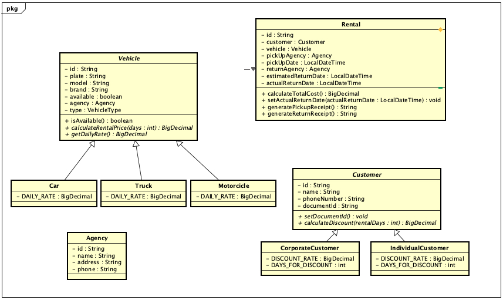
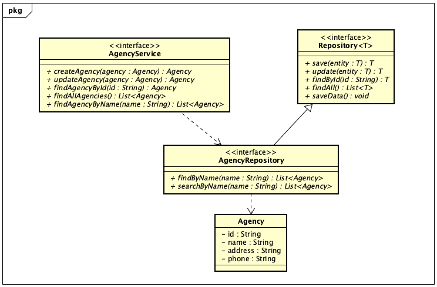
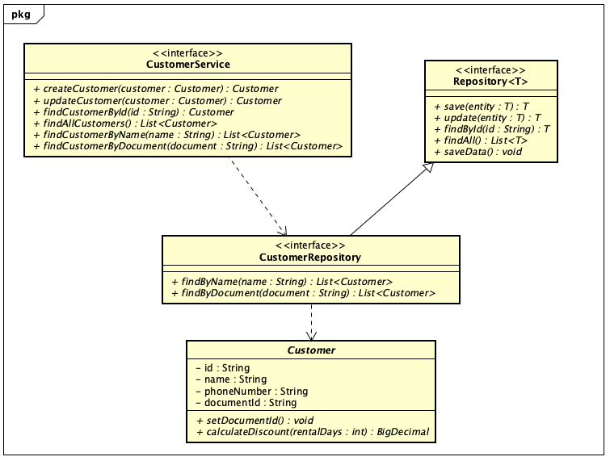
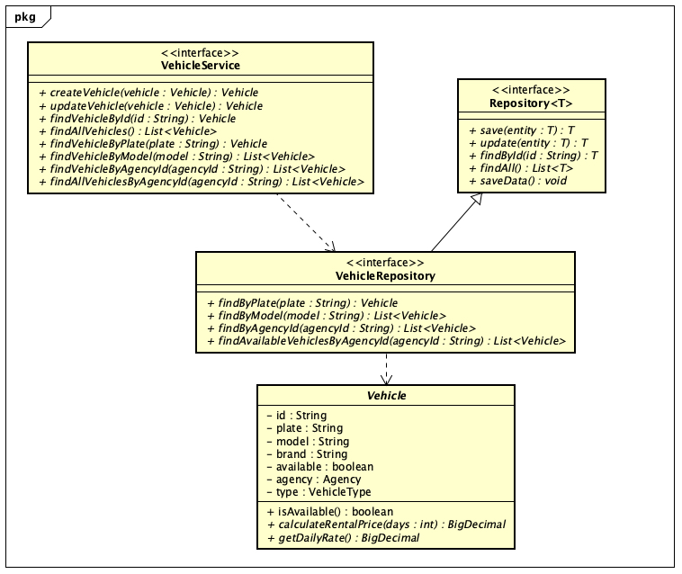

# Coders24 - Locadora de Veículos (CodersRental)

## Descrição

Este projeto é uma aplicação Java que fornece uma interface de usuário para gerenciar clientes e agências. Ele inclui
funcionalidades para listar, filtrar e selecionar clientes e agências.

## Funcionalidades

- Listar clientes e agências
- Filtrar clientes e agências por nome
- Paginar através das listas de clientes e agências
- Selecionar um cliente ou agência da lista

## Requisitos

- **Java 11** ou superior
- **Maven 3.6.3** ou superior
- **Git** instalado para clonar o repositório

## Como Baixar e Executar o Projeto

Siga as instruções abaixo para baixar e executar o projeto localmente.

### Clonando o Repositório

1. Abra um terminal (ou Prompt de Comando no Windows).

2. Navegue até o diretório onde deseja armazenar o projeto.

3. Execute o seguinte comando para clonar o repositório:
```sh
git clone https://github.com/dluks82/coders24_pooii_locadora.git
```

4. Entre no diretório do projeto:
```sh
cd coders24_pooii_locadora
```

## Configuração e Execução

Este projeto está configurado para usar o Maven Wrapper, permitindo executar comandos do Maven sem ter o Maven instalado
no sistema. Se preferir, também pode rodar diretamente com o Maven instalado.

### Usando o Maven Wrapper

#### No macOS/Linux

1. Abra um terminal.
2. Navegue até o diretório do projeto.
3. Execute o seguinte comando para construir o projeto:
    ```sh
    ./mvnw clean install
    ```
4. Para executar a aplicação, use:
    ```sh
    ./mvnw exec:java -Dexec.mainClass="CodersRentalApp"
    ```

#### No Windows

1. Abra o Prompt de Comando.
2. Navegue até o diretório do projeto.
3. Execute o seguinte comando para construir o projeto:
    ```sh
    mvnw.cmd clean install
    ```
4. Para executar a aplicação, use:
    ```sh
    mvnw.cmd exec:java -Dexec.mainClass="CodersRentalApp"
    ```

### Usando o Maven Diretamente

Se você já tiver o Maven instalado em sua máquina, pode usar os seguintes comandos:

#### No macOS/Linux

1. Abra um terminal.
2. Navegue até o diretório do projeto.
3. Execute o seguinte comando para construir o projeto:
    ```sh
    mvn clean install
    ```
4. Para executar a aplicação, use:
    ```sh
    mvn exec:java -Dexec.mainClass="CodersRentalApp"
    ```

#### No Windows

1. Abra o Prompt de Comando.
2. Navegue até o diretório do projeto.
3. Execute o seguinte comando para construir o projeto:
    ```sh
    mvn clean install
    ```
4. Para executar a aplicação, use:
    ```sh
    mvn exec:java -Dexec.mainClass="CodersRentalApp"
    ```

## Diagramas de Classe

#### Geral


#### Agência


#### Customer


### Vehicle


## Licença

Este projeto está licenciado sob a [**Licença MIT**](LICENSE).

## Contribuidores

- [Breno Torquato](https://github.com/Br3nOT)
- [Diogo Oliveira](https://github.com/dluks82)
- [**Guilherme Meneghini**](https://github.com/guimeneghini)
- [**Irving Caetano**](https://github.com/Irving1409)
- [**Rômulo Domingos**](https://github.com/RAODomingos)
